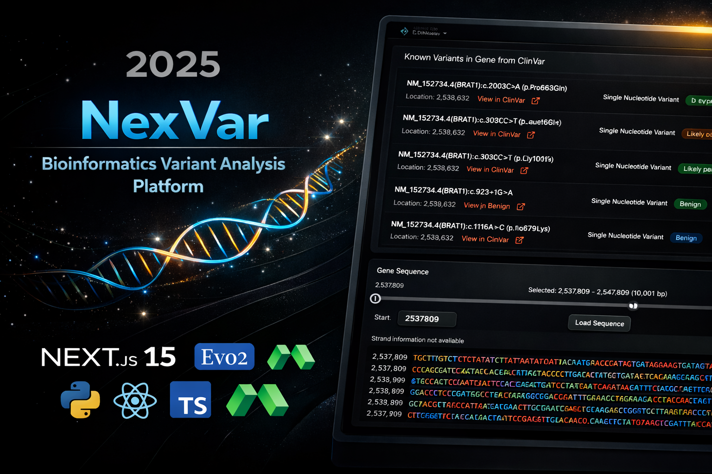

# NexVar: Advanced Variant Analysis Platform



> **Paper**: [Genome modeling and design across all domains of life with NexVar](https://www.biorxiv.org/content/10.1101/2025.02.18.638918v1)  
> **Repository**: [Eldergenix/NexVar](https://github.com/Eldergenix/NexVar)

## Project Abstract

**NexVar** represents a paradigm shift in computational genomics, democratizing access to state-of-the-art foundation models for variant effect prediction (VEP). This platform integrates the **NexVar** DNA language model—trained on 8.8 trillion tokens from all domains of life—into a cohesive, full-stack application.

By coupling High-Performance Computing (HPC) backends with an accessible, research-grade frontend, this project aims to impose the predictive power of 1-million-context-length models directly onto the clinical research workflow.

## System Capabilities

The architecture allows researchers to:

- **Predict Pathogenicity**: Utilize the NexVar model to classify SNVs as _Likely Pathogenic_ or _Likely Benign_ based on evolutionary likelihood intervals.
- **Analyze Long-Range Context**: Leverage the StripedHyena 2 architecture to understand mutation effects within windows of up to 1 million base pairs (backend capability).
- **Validate via ClinVar**: Benchmark AI predictions against established clinical assertions from NCBI ClinVar.
- **Visual Genome Analysis**: Interactively browse chromosomes and gene regions (hg38/hg19 assemblies).

## Architecture Components

The platform consists of two primary subsystems:

### 1. The Inference Engine (Backend)

_Located in `nexvar-backend/`_

- **Core**: Python-based API wrapping the NexVar library.
- **Compute**: Deployed on **Modal** Serverless GPU infrastructure (H100).
- **Function**: Handles model loading (7B/40B parameters), tokenization, and forward-pass inference.

### 2. The Research Workspace (Frontend)

_Located in `nexvar-frontend/`_

- **Core**: Next.js / TypeScript web application.
- **Interface**: Scientific dashboard for gene search, variant input, and results visualization.
- **Deployment**: Hosted on **Railway** for high availability.

## Getting Started

### Prerequisites

- **Computational**: Access to Modal (for backend) and Railway (for frontend).
- **Local**: Python 3.10+ and Node.js 18+.

### Installation Strategy

#### Phase 1: Deploying the Inference Engine

The backend must be operational first to provide API services.

```bash
cd nexvar-backend
pip install -r requirements.txt
modal deploy main.py
# >> Save the output URL.
```

#### Phase 2: Launching the Workspace

The frontend consumes the inference API.

```bash
cd nexvar-frontend
npm install
npm run dev
```

## Citation

If this platform aids your research, please cite the foundational work:

> Brixi, G., et al. (2025). Genome modeling and design across all domains of life with NexVar. _bioRxiv_. doi:10.1101/2025.02.18.638918
